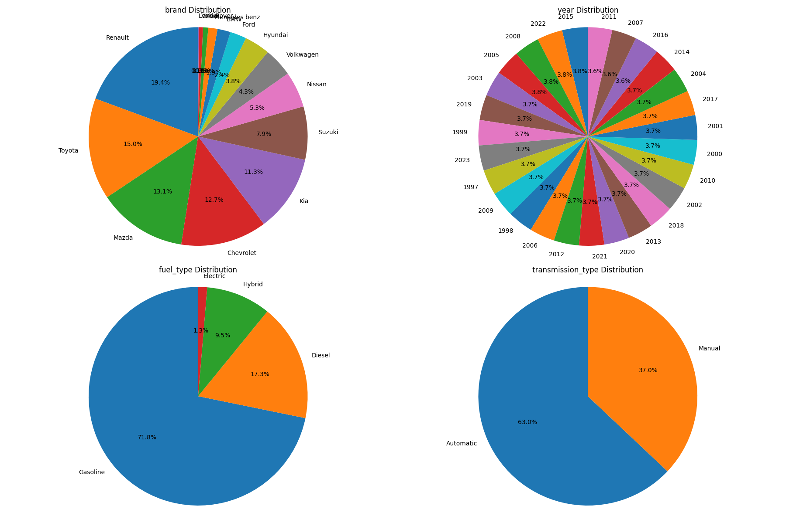
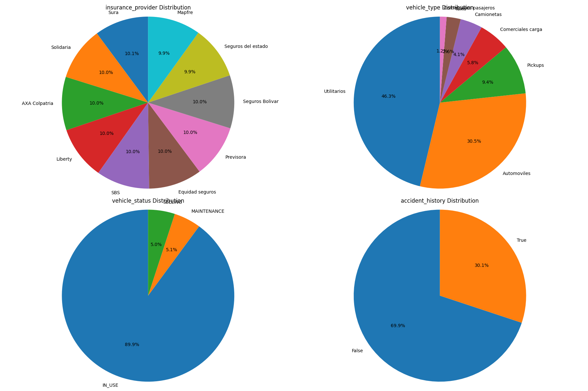
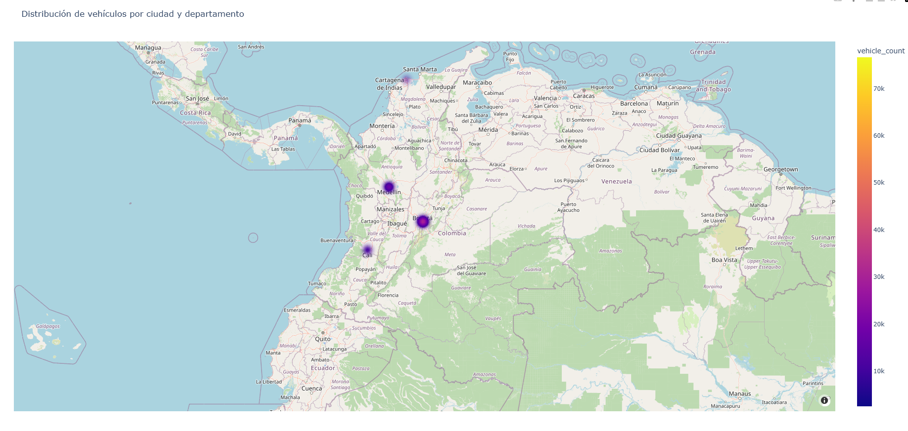
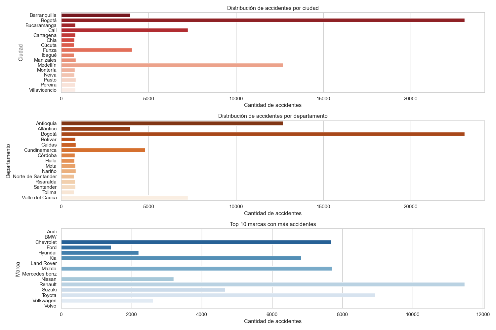
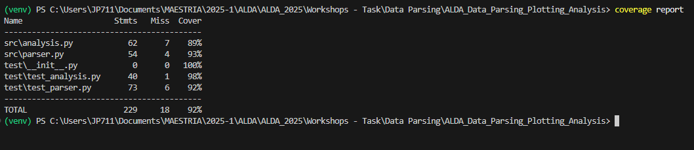

# Vehicle Data Parsing, Plotting & Analysis

## Introduction

This project provides tools for parsing, cleaning, and analyzing a large dataset of vehicles. It includes scripts for data validation, preprocessing, and visualization, allowing users to explore vehicle characteristics, insurance information, accident history, and more. The project is designed for efficient handling of large CSV files and produces insightful plots to support data-driven decision making.

## Project Structure

The repository is organized as follows:

```
ALDA_Data_Parsing_Plotting_Analysis/
│
├── data/
│   └── out_200000.csv           # Raw dataset file (input)
│
├── plots/
│   └── ...                      # Output directory for generated plots
│
├── src/
│   ├── parser.py                # Functions for loading, cleaning, and validating the dataset
│   └── analysis.py              # Functions for data analysis and visualization
│
├── tests/
│   └── test_parser.py           # Unit tests for parser functions
│   └── test_analysis.py         # Unit tests for analysis functions
│
├── main.py                      # Main script to run the analysis pipeline
├── requirements.txt             # Python dependencies
└── README.md                    # Project documentation
```

### File Descriptions

- **data/out_200000.csv**  
  Main dataset file containing vehicle records.

- **plots/**  
  Directory where all generated plots and visualizations are saved.

- **src/parser.py**  
  Contains functions for reading the CSV, cleaning, validating, and preprocessing the dataset.

- **src/analysis.py**  
  Contains functions for generating plots and performing data analysis.

- **tests/**  
  Contains unit tests to ensure the correctness of parsing and analysis functions.

- **main.py**  
  Entry point for the project. Loads the dataset, runs cleaning and analysis, and generates plots.

- **requirements.txt**  
  Lists all Python dependencies required to run the project.

- **README.md**  
  Project documentation, including usage instructions and dataset description.

## About the Dataset

The dataset contains detailed information about vehicles, their technical specifications, ownership, insurance, and operational status. Each row represents a single vehicle record. The fields include identifiers, vehicle characteristics (such as brand, model, year, color, engine size), usage data (odometer reading, accident history), ownership details, insurance information, and administrative data (registration, location, and status). This comprehensive structure allows for in-depth analysis of vehicle demographics, market value, safety, and trends in insurance and maintenance.

The dataset contains the following fields for each vehicle:

| Field                      | Data Type      | Description / Format                              |
|---------------------------|---------------|--------------------------------------------------|
| `id`                      | integer       | Unique identifier                                |
| `plate_number`            | string        | Vehicle license plate (3 letters + 3 numbers)    |
| `brand`                   | category      | Vehicle manufacturer brand                      |
| `model`                   | category      | Vehicle model designation                       |
| `year`                    | integer       | Manufacturing year (YYYY)                       |
| `color`                   | category      | Exterior color                                  |
| `fuel_type`               | category      | `Gasoline`, `Electric`, `Diesel`, `Hybrid`      |
| `transmission_type`       | category      | `Automatic`, `Manual`, `CVT`                    |
| `odometer_reading`        | float         | Current mileage (km or miles)                   |
| `insurance_provider`      | category      | Insurance company name                          |
| `owner_name`              | string        | Legal owner's full name                         |
| `owner_id`                | string        | Government-issued ID number                     |
| `owner_address`           | string        | Complete street address                         |
| `city`                    | category      | Registration city                               |
| `department`              | category      | State/Province/Department                      |
| `vehicle_type`            | category      | `Sedan`, `SUV`, `Truck`, etc.                   |
| `engine_size`             | float         | Displacement in liters (e.g. 2.0)               |
| `wheel_drive`             | category      | `FWD`, `RWD`, `AWD`, `4WD`                      |
| `number_of_seats`         | integer       | Passenger capacity (2-9)                        |
| `number_of_doors`         | integer       | Typically 2, 3, 4, or 5                         |
| `gps_installed`           | boolean       | `True`/`False`                                  |
| `emission_standard`       | category      | `Euro 6`, `Tier 4`, etc.                        |
| `safety_rating`           | category      | `1-5 stars` or `A-F` scale                      |
| `insurance_coverage_type` | category      | `Full`, `Liability`, `Collision`                |
| `estimated_market_value`  | float         | Current value in local currency                 |
| `vehicle_status`          | category      | `IN_USE`, `SELLING`, `MAINTENANCE`, `REPAIR`   |
| `accident_history`        | boolean       | `True` if previously damaged                   |
| `registration_date`       | date          | First registration date (YYYY-MM-DD)            |
| `insurance_expiration_date` | date        | Policy end date (YYYY-MM-DD)                   |
| `last_maintenance_date`   | date          | Most recent service date (YYYY-MM-DD)           |


### Creating a Virtual Environment

To create a virtual environment for this project, follow these steps:

1. Open a terminal in the project directory.
2. Run the following command to create the virtual environment:

   ```sh
   python -m venv venv
   ```
This will create a folder named [`venv`](/venv) in the project directory.

3. Activate the virtual environment:
    ```sh
    venv/bin/activate
    ```
4. Install the required dependencies:
    ```sh
    pip3 install -r requirements.txt
    ```
Importance of a Virtual Environment:
- Dependency Management: Ensures that the project uses the correct versions of libraries specified in requirements.txt.
- Isolation: Prevents conflicts between dependencies of different projects.
- Reproducibility: Makes it easier for others to set up and run the project with the same environment.


## Implementation

### 1. Data Parsing and Cleaning

- The `parser.py` module loads the dataset, validates data (e.g., plate format, fuel type), removes duplicates, and processes columns (e.g., converts engine size, parses dates).
- Data types are enforced for each column to optimize memory usage and ensure consistency.

 This module is responsible for all data ingestion and preprocessing tasks. It includes functions to:
  - Load the dataset from a CSV file.
  - Enforce data types for each column to optimize memory usage.
  - Clean the data by removing empty rows, normalizing column names, and handling missing values.
  - Validate key fields such as vehicle plate format, fuel type, vehicle status, and transmission type.
  - Remove duplicate records and records with missing critical information (e.g., owner ID).
  - Convert and process specific columns, such as extracting numeric values from engine size, and parsing date fields.
  - Prepare the DataFrame for analysis by ensuring consistency and reliability of the data.


### 2. Data Analysis and Visualization

- The `analysis.py` module provides functions to generate plots for:
  - Vehicle distribution by brand, year, fuel type, and transmission.
  - Insurance provider and vehicle status.
  - Accident history.
  - Vehicle locations on a map (if location data is available).
- Plots are saved in the `plots` directory for further inspection.

This module contains all the functions for data analysis and visualization. It provides:
  - Functions to generate categorical plots (e.g., distribution of brands, years, fuel types, transmission types).
  - Visualization of insurance-related data, such as insurance provider distribution and vehicle status.
  - Functions to plot accident history and analyze trends or patterns in accidents.
  - (If available) Functions to plot vehicle locations on a map using geographic data.
  - The module is designed to be easily extensible for additional analyses or custom visualizations.


### 3. Testing

- The `tests/` directory contains unit tests to ensure the correctness and reliability of the project's core functions.
  - **test_parser.py**: Includes tests for the data loading, cleaning, and validation functions in `parser.py`. These tests check that the dataset is correctly parsed, invalid or duplicate records are removed, and columns are properly processed.
  - **test_analysis.py**: Contains tests for the plotting and analysis functions in `analysis.py`. These tests verify that plots are generated without errors and that the analysis functions handle different data scenarios as expected.

## Results Analysis

Below are the main plots generated by the project, located in the `plots/` directory. Each plot provides insights into different aspects of the vehicle dataset:

### 1. Vehicles Distribution

This plot shows the distribution of vehicles by brand, year, fuel type, and transmission type. It helps to visualize the most common brands and models, the age distribution of vehicles, the prevalence of different fuel types (such as gasoline, diesel, electric, or hybrid), and the proportion of vehicles with automatic vs. manual transmission.


### 2. Insurance distribution

This plot displays the distribution of vehicles by insurance provider, vehicle type, vehicle status (e.g., IN_USE, SELLING, MAINTENANCE), and accident history. It allows you to analyze which insurance companies are most popular, the types of vehicles most commonly insured, the operational status of the fleet, and the proportion of vehicles with a history of accidents.




### 3. Distribution Map

This map visualizes the geographic distribution of vehicles based on their registration city or department. It helps identify regional trends, concentrations of vehicles, and possible market opportunities or risks in specific areas.



### 4. Accident history

This plot summarizes the accident history of the vehicles in the dataset. It may show the number or percentage of vehicles with and without accidents, or trends over time if date information is available. This analysis is useful for understanding the safety profile of the fleet and identifying risk factors.




# Accident Distribution Analysis (Colombia)

## Key Insights from the Visualization

### 1. Accident Distribution by City
The chart shows accident frequency across major Colombian cities:
- **Highest accident volumes**: Bogotá, Cali, Medellín (likely due to higher vehicle density)
- **Mid-range cities**: Barranquilla, Bucaramanga, Cartagena
- **Lower accident counts**: Smaller cities like Chía, Pereira, Villavicencio
- **Data anomalies**: Possible misspellings ("Manzales" for Manizales, "Medelli" for Medellín)

### 2. Accident Distribution by Department
Breakdown of accidents across administrative regions:
- **Top affected departments**: Antioquia, Atlántico, Valle del Cauca
- **Notable inclusions**: 
  - Bogotá appears both as city and department (Cundinamarca)
  - Some spelling inconsistencies ("Caídas" likely Cauca, "Pasarada" unknown)

### 3. Vehicle Brands Accident Ranking
Top manufacturers involved in accidents:
- **Leading brands**: Chevrolet, Renault, Toyota (consistent with market share)
- **Premium brands**: Audi, BMW, Mercedes-Benz show lower volumes but higher severity potential
- **Asian brands**: Hyundai, Nissan, Suzuki show moderate accident rates

## Data Visualization Notes
- **X-axis**: Uniform scale (0-20,000 for cities/departments, 0-12,000 for brands)
- **Y-axis**: Categorical variables (geographic and brand entities)
- **Chart type**: Appears to be horizontal bar charts (though exact graphic not visible)
- **Data quality flags**: Several spelling errors in geographic names that may affect analysis

## Recommended Actions
1. **Data cleaning**: Standardize city/department names (Medellín, Manizales, etc.)
2. **Normalization**: Consider accidents per 1,000 vehicles for fair comparisons
3. **Drill-down**: Add time dimension to identify trends
4. **Root cause**: Investigate why certain brands appear disproportionately


## Conclusions

The analysis of the vehicle dataset provides valuable insights into the characteristics and trends of the vehicle fleet. The main conclusions from this project are:

- **Data Quality and Cleaning:** The implemented data parsing and validation steps ensure that the dataset is clean, consistent, and reliable for analysis. Removing invalid, duplicate, or incomplete records improves the quality of the results.

- **Fleet Composition:** The visualizations reveal the most common brands, models, and years, as well as the prevalence of different fuel types and transmission systems. This information is useful for understanding market trends and consumer preferences.

- **Insurance and Status:** The analysis of insurance providers and vehicle statuses highlights which companies dominate the market and the operational state of most vehicles. This can inform business strategies for insurance companies and fleet managers.

- **Geographic Distribution:** Mapping the vehicles by city and department uncovers regional patterns, concentrations, and potential areas for business expansion or targeted interventions.

- **Accident History:** The accident history analysis helps identify risk factors and the brands or regions with higher accident rates. This information is valuable for safety initiatives and insurance risk assessment.

- **Market Value:** The relationship between vehicle status and estimated market value provides insights into how operational status affects pricing, which is useful for both sellers and buyers.

Overall, the project demonstrates the importance of thorough data cleaning, validation, and visualization in extracting actionable knowledge from large datasets. The modular design allows for easy extension and adaptation to new data or analysis requirements.

##  Coverage

Coverage generates a report showing what percentage of each code file was covered during testing. The report also shows a summary of the total coverage for the entire project. In this case, 92% of the code was covered during testing.




